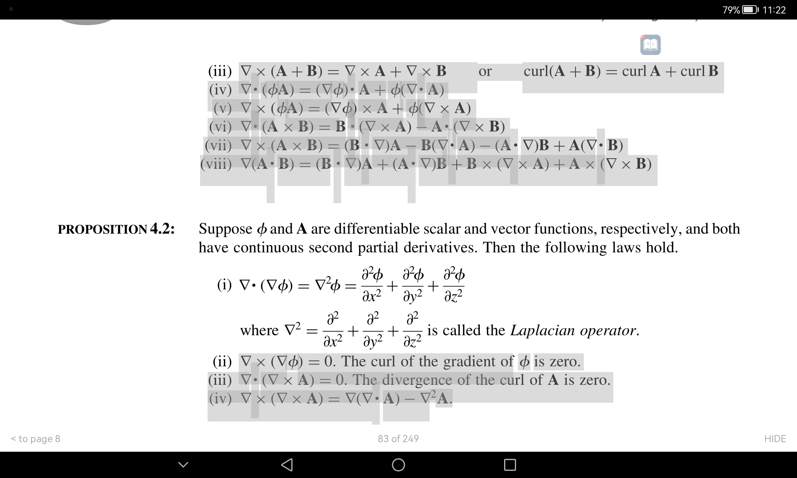
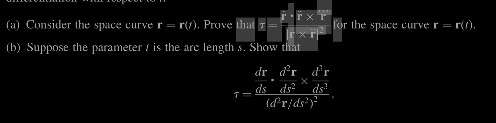

# useful numbers in a system.
In group theory,polynomial,differential equation 0 is really useful.
In category theory, Identity function is really useful.

In linear algebra,Given a matrix,their eigenvalue,eigenvector are useful.

So the question is given a setup,Is there a way so given a setup,I can get all the important 
object from the system.
1. find a important object,in a graph,in combinatrics.

## Get a induction,that can go through all real number.
I have a way to prove induction for all natural number.
Like if it works for n,than it will work for n+1,

1. Use induction for to prove something for all rational number.
Like for if it works for n,it works for n+1,n/2.But it has a problem.
It doesn't go to all rationals in finite times.If there is a way to do it,in two or less condition.

2. Try to do it for real number.

## Graph coloring problem
What is the minimum color needed for a graph to be drawn is considered to be a NP hard problem.

If you think about it,The first approach comes to mind is to use minimum number 
of color,only increase the number of color when there more color is needed.

## Understanding equation as Dot product

1. A problem in math like $A={(x,y,z)\in R^3:a_0x+b_0y+c_0z=0 && a_1x+b_1y+c_1z=0}$
Now I need to find the $Dim(A)$,which $Dim(R^3)-Dim(span([a_0,b_0,c_0],[a_1,b_1,c_1]))$
How to do i as a tool?

2.Given a linear function as a matrix multiplication,
    - By making it as essolion form,We can make it so that,We can get the span of the vector.
    - Can I get the kernal of the matrix(All vector that multiplpies by matrix returns 0)by the cross multiple of the essilion form.
    - Can we define any Vector space as a equation of Dot product.

## Finding an algorithm,that find all the constant in a system
#### Apporach
1. If there is any continious change orthogonal to the position,the distance don't change.
2. As polynomial functions are vector,We could choose the distance function anything We want,than 
find all the things that are orthogonal to it.

## Finding $f^{1/2}(x)$
For a function f,find $f^{1/2}$ so that $f^{1/2}(f^{1/2}(x))=f(x)$
#### Approach
1. Find the 1/2 power of a matrix.
2. Given a function with it's domain and range,Can I find $f^{1/2}$ that can in the same domain and
range.
I mean I can make $f^{1/2}$ where $f^{1/2}(x)=x^{f^1/2}$ it is just a notation trick like,
($f(x)=x^2,f^-1(x)=\root{x}$ where the definition of \root{x} is \root{x}^2=x)

### Do taylor transform like foreier transform
Forier transform is like foreier series but for continious series.
Like $f(t)=...+c_-1e^{2\pi .-1. it}+c_0e^{2\pi.0. it}+..$
Now,$c_n=\intregate_{0}^{1}f(t)e^{-2\pi .n.t}$
Which is same as forier transform $g(f)=\intregate_{-\inf}^{\inf}f(t).e^{2\pi iwt}dt$
Now I need to do the same thing for taylor series,A continious version of taylor series.

### Problem with topological sort
My first observation lead to me a code in topological sort
```python
def topological_sort(node:Node)->[Node]:
#Topological sort of all nodes that can be go from that node.
    ans=[]
    x.processing=true;
    for x in node.child:
        if x.finished==true:
            continue
        if x.is_processing==true:
            return Error;
        ans.push_front(topological_sort(x))
    ans.push_front(node)
    return ans        
```
The code would be lot easier if the directed graph is also a tree.That code would be
```python
def toposort(node:Node):
    ans=[]
    for x in node.child:
        ans.push_front(topological_sort(x))
    ans.push_front(node)
    return ans
```
If I write this code efficient way The book told me:
```python
gloabl_ans=[]
def toposort(node:Node):
    for x in node.child:
        topological_sort(x)
        ans.push_back(x)
    return gloabl_ans.reverse()
```
Can I make a tool and can find out this two code are same.

## School work
1. Intregate A volume of shape of a extruded triangle.
2. Given a element in a array,A linear search takes O(N/2) checks on average.
    - But If have to search two element in a linear search,What is the amount of operation needed on average.
    - Find a ideal algorithm,If two graphs are equal.

## All form of dot product and one and two dimension matrix multiplication
We know dot product,that's project in a line.
Do the same thing for a plane.
A matrix $M=A*B^T$ where A and B is vector of same dimension,The 
matrix encapsulate dot product and linear scaling in one operation.
Every matrix that is of dimension 1 can be represent as dot product and linear scaling
So what a 2 dimensional vector can be represent as two seperate operation.

## Match field with vector and make a sense out of it.
What are all the things that make a field and 1 dimensional vector different,
Matrix is a vector of vectors.I want to blur out the line of fields and vector.
#### What I found
1. Matrix with vector multiplication is basically dot product.
Like $\begin{bmatrix} \vec{X} & \vec{Y} & \vec{Z} \end{bmatrix}
.\begin{bmatrix} A_x \\ A_y \\ A_z \end{bmatrix}$

Here matrix is 3 dimensional vector where field is a 3 dimensional vector.
So there is 3 types of multiplication in vector,
One is multiplication that increase dimension.Multipling 2 vector to create a matrix 
Like $\vec{A}.\vec{B}^T$ which returns a matrix ,like
$\vec{A}*\vec{B}=\begin{bmatrix}A_i . B_i \\ A_j .B_j \\ A_k.B_k \end{bmatrix}$
and one that keeps the dimension same
$\begin{bmatrix} \vec{A}.B_x  & \vec{A}.B_y & \vec{A}.B_z\end{bmatrix}$
So,we could denote this two product as min product(dot product) operated with "." and 
max product(that increses dimension) as *.
> **TODO:** When expanded and contracted it isn't obivious,What the expanded product would be like.
> Like $\vec{A}.\vec{B}=\sum{A_i.B_i} or \sum{A_i*B_i}$

## Vec Equivalance
If two vector are equivalance,We know there varaible of the basis are equal.
In a official way of saying $\vec{A}=a_1\vec{A_1}+a_2\vec{A_2}$
$\vec{B}=b_1\vec{A_1}+b_2\vec{A_2}$ where $\set{A_1,A_2}$ is linear independent.

This implies, $a_1=b_1 & a_2=b_2$
There is another example if number $a$ prime factorization vector is $\vec{A}$ and
$b$ prime factorization vector is $\vec{B}$ that means,
all the element of the vector are equivalent.

I guess this is because,they are multiplicative indepedent,You can't make one prime by by multiplying 
other primes.
Make a tool out of this,
"+" opearator independent elements are set of those elements,so one element can't be make by the 
combination of other element.

If we know two elements are equivalent,We know there operator combination are equivalent.

## TODO:
Try to make a K-Map for multiple variable.
Different prove for why a sequence of closed bounded set always has a convergent subsequence?
Solve this,why dot product and divergence are difference.How this should be treated:


Sove this 


$sin_deg()$ and $sin_rad()$ are different funtion.
This is because function has take values as real number,It don't take unit.
What if it do take unit,How will function behave if pure math use unit.
So  what I want other then creating two different function,$sin_deg~sin_rad$
$sin_deg(x*\frac{180}{\pi})=sin_rad(x)$
I will have $sin(a^\degree)$ or $sin(a^\radian)$

Solving differential equation using matricies
Like $M^dt$ where $M$ is a matrix.
How a cross product of cross product will behave using a diterminent.
There are different ways to remove one component of a vector from other vector
One common approach $\vector{B_1}=\vector{B}-\vector{A^\cap}.vector{B}
to remove A's component from \vector{B}
Another approach is $-vector{B_1}=\vector{A}\cross\vector{A}\cross\vector{B}$

Doesn't cross product obeys selective property AKA> $A\cross(B\crossC)=((A\crossB)\cross C)$
Then why $B_1=\vector{0}\cross\vector{B}$

Given 3 vectors $A,B,C$ there orthogonal equivalent vector is,
$A_1=A$ you need one vector that have to be one vector.
$C_1=A*B$
$B_1=C*A$


### Try to represent number,different from n bases number

