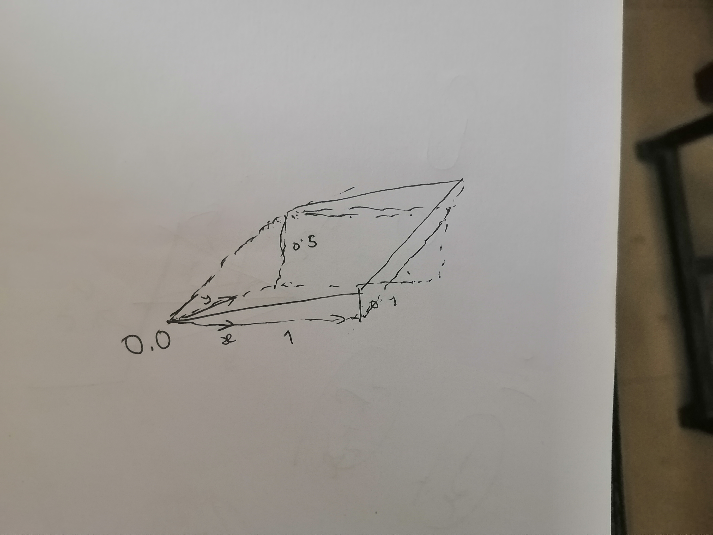

## Questions:
1. How gradient works?
2. why differential is linear?

## Why differential is linear
### Question:
1.Why is limit linear?
Geometric interpetation:Differential removes output of the function and returns the line of each point.
Line is additive,and multiplicative

2. How gradient works?
I have a issue about why gradient indicates to the maximum direction,
it accutually makes no sense as let's say a plane with 0,0 point in center,0.1 tangent in x direction and
0.5 tangent in y direction.

