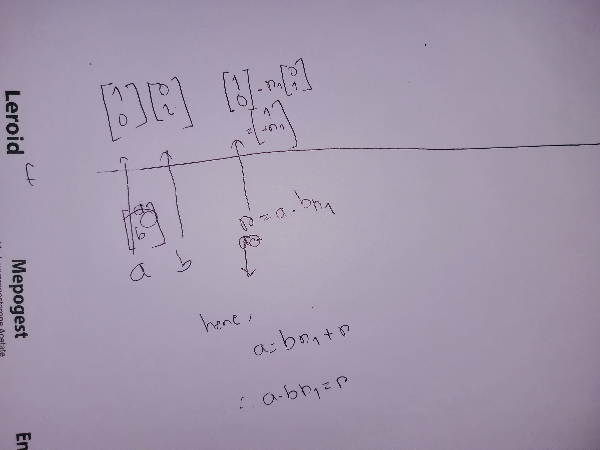

## The idea

When I need to make an algorithm to find bezouts coefficient,So given 2 number $a,b$
I have to find $x,y\in N$ so that $ax+by=gcd(a,b)$.
Now to solve this I created two world,one is a field,other is Vec2.
$$f(\begin{bmatrix} x \\ y \end{bmatrix}:Vec2)->\begin{bmatrix} a & b \end{bmatrix}
. \begin{bmatrix} x \\ y \end{bmatrix}$$

So sometimes it is ok,to keep two different worlds in your head,keep it in a table.

The upper world precieves any number as a  vec2,which is a linear combination of down number.
The down number is better for gcd,keeping both in the table keeps track.
