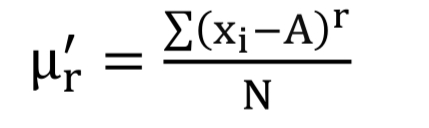

We can represent a distribution,datapoint as vector,that's why we have 
$\frac{\sum{(x-\cap{x})*(y-cap{y})}}{\sqrt{\sum{(x-\cap{x})^2}+\sum{(y-\cap{y})^2}}}$
,which is cofficient of correlation.
Now this data of x can also be one to one mapped to raw moment 

which means X(which is data) and can also be be described as a vector also has 
a one to one vector which we can name raw vector?What are the property and application of it?

Also the equation 
$\frac{\sum{(x-\hat{x})*(y-\hat{y})}}{\sqrt{\sum{(x-\hat{x})^2}+\sum{(y-\hat{y})^2}}}$ ,which is basically $cos \theta=\frac{\dot{\vec{A}}{\vec{B}}}{\abs{A}\abs{B}}$

where $\vec{A}=(x-\hat{x})$,and so on,
So the question is there some property $(x-\hat{x})$ has,like say $\vec{X}=x$ and $\vec{A}=(x-\hat{x})$ is a projection of $\vec{X}$ in $\matrix{1 1 1}$ plane,as dot product with the vector returns 0,there isa property,like $\sum{x^2}=N\hat{x}^2+\sum{(x-\hat{x})^2}(Variance)$,

If function is a vector,then inverse function is a distribution!!That's distribution can be treated as Vector??

