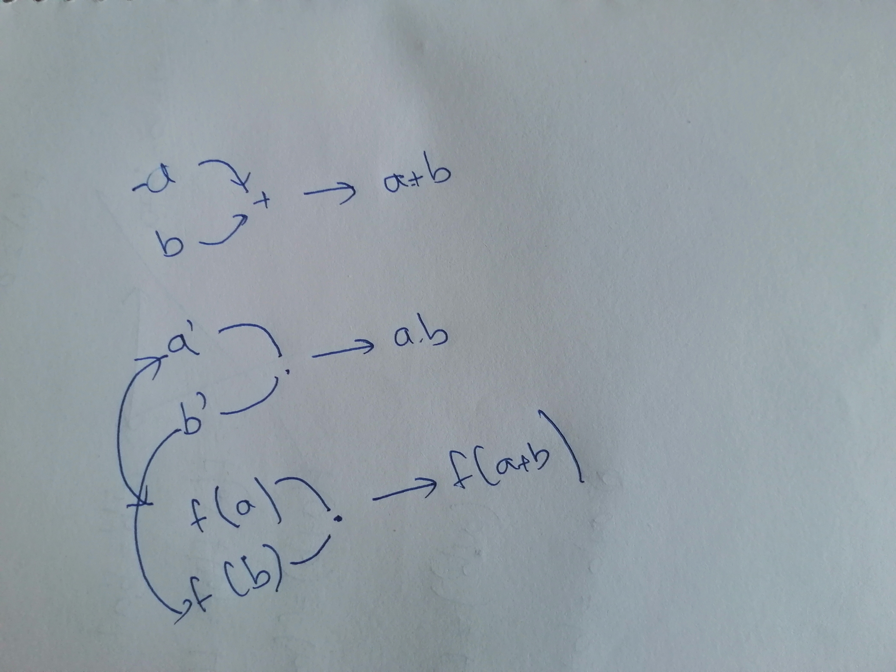
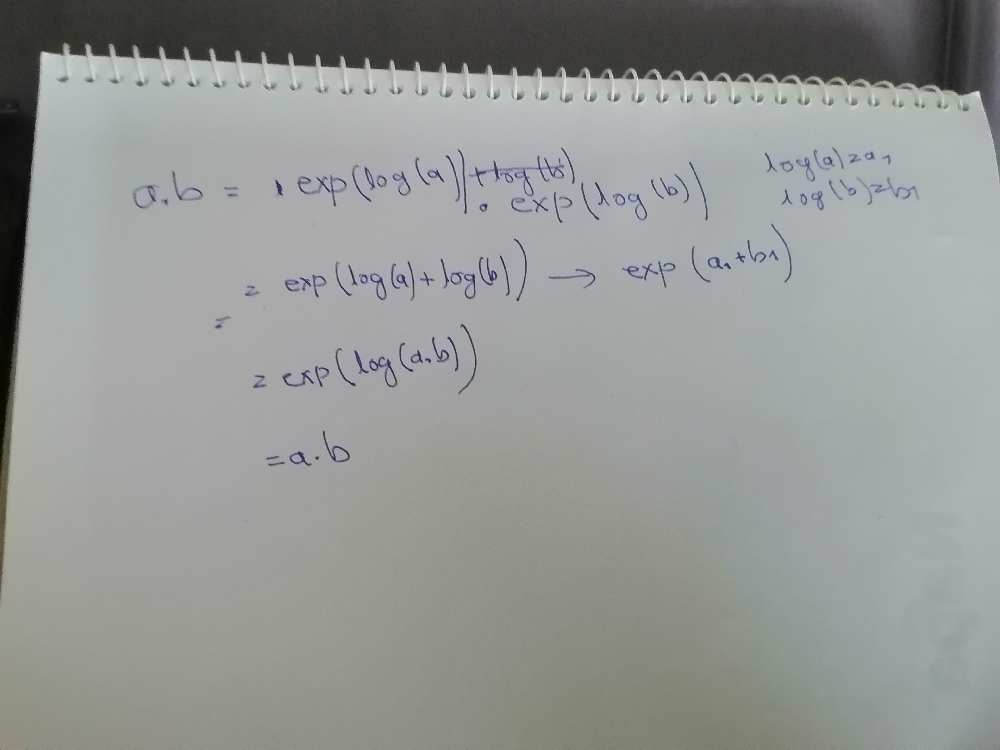

# Modulo topic

# Main topic
Start with a simple question? What is equal?
Simple answer:When two object are same are equal relation to each other.
Now how do you know what  object is what?The answer is what relation it has with other object or function.There is no other way.
ex:How do I know if it is positive charge or not,check with other positive charge how it behaves.

Name our world **world_A**

Imagine a world **world_B**

world_B where there are three type of charge,
1. positive
2. negative
3. motative

The interaction with positive and negative is same as our world(world_A).The interaction with motative is:
1. positive<=>motative = attraction
2. negative<=>motative = repulsion
3. motative<=>motative = attraction

**TODO: I am curios what are the relation with motative it need, to distinguish it from postive,negative.Let's say there are a lot of unknown charges there.Can I find motative from them.How the relation between should be to detect a motative without knowing what the other the other charge are.**

First thing what is world?A world is a set of objects which have different relation between them,those relation can be axiom,functions,operator etc.
>Might be wrong:All object in a world has relation with other object directely or indirectely. In a mathematical way to say it:$A~world~set~A~and~B\subset~A~then~\exist x \in B \exist y \in A/B~x~has~relation~with~y.$
>
>**TODO:Prove that,A graph A is connected,then any subset B there exist a node that has edge with a node in subset A/B**
.Let's say $A$ a world set and function $relation(a,b)$ which returns true if $a$ and $b$ has direct relation with each other like f(a)=b and f(b)=a,or a function f(a,b) exist for f a function in the world $A$.

1. For all non-empty subset B of A there exist x in B,there exist y in A/B such that there exist relationship between A and B.

>TODO: I need to define what it means to have relation. Do I need both f(a)=b and f(b)=a or anyone.
>Like our world has many object.We know they exist because they interact with the known particle we know.
>We know the known particle because they directely or indirectley interect with the particle we are created from.
>Now let's say you want to find new particle outside in the standard model.
>To detect new particle you need to test the unknown particle(or check the relation between them) with the known particle.
>If the relation between them don't match anything with the known one,You discovered a new one.
>A question is "Is there a element in our universe that don't interect with our current elements of standard model?"
>There could be.
>If there is,would that be included in our world set.The answer should be "No."It should be because maybe that particle don't have any interaction with our world.But that particle might got affected by our presence.Like that particle might change it's state if a positive charge get close to it.But the positive charge,that remains unaffected.
>Maybe there is a bigger world than our own world. Those extra particle don't have any effect own us,but our existance do effect them in lot of ways.So,Will the bigger world will make us part of that world or not?We do effect them but they don't effect us in any way.I think we should.Though in our world,there isn't any smaller world as we know it.(Dark matter might be one of them.)

**Let's name the **

So what I wanna say equivalance in one world doesn't have to be equivalance in other world.Like in our world suppose a charge **A** that
1. Repel a negative charge.
2. Attract a positive charge.
We will deduce A=negative,as A obeys all properties negative has.But in a super world A =negative or motative.
As you check what a object is by making equivalent comparasion witih other object.An object in one world doesn't have to be same in other  world.Like,2 in mod 3 world is not equal to 2 natural numberline.

It could be {..-2,2,5...}.In real numberline it could be a lot more.

## Things we learned:
1. How to check if two world are equivalent.
2. Like there are logarithm that change the relation between addition and multiplication to multiplication and power.
So does the two world are equivalent.We use the log function to cast from one world to other and vice-versa.But log do return real number,how does that work ?Well addition,multiplication,power are all part of real number and addition,multiplication and multiplication,power are subworld of that world which are equivalent.Which is why they can be refer to one object.If two world are  equivalent,you can convert object to other and vice-versa.

**TODO: There are some issue in the log and $e^x$ like even if addition and multiplication maps the dom in natural number the logarithm send it to irrational number.So after changing from one world to other world you might need to expand the number system.**

**TODO:**
1. Make a function and number system that converts thing like max,min,gcd,modulo max,min,gcd to addition,take the image under it as reference.

Bacause those two world are equivalance,They can be mapped by one-to-one function.
3. A world can have subworld. Now there is a problem on how to define a subworld. 

1. $a(mod x)={a+nx: x in N}=a+0(mod x)$ **TODO:What are the special properties 0(mod x) and 1(mod x) have compared to  a(mod x)
I feel like it has some more benefit**

2. $(a+b)(mod x)=a(mod x)+b(mod x)$

3. $a(mod 1)=N$

4. $a(mod x)=a(mod x_1) \cap a(mod x_2) \cap a(mod x_3)$ .... where $x=lcd(x_1,x_2,x_3.....)$
that's mean a(mod x) subset of a(mod x1),a(mod x2)..

5. $a(mod x) \cap b(mod x)$ =null for a(mod x)!=b(mod x)$

6. $x*a(mod x)=0(mod x)$ That's where 0(mod x) is important.

7. $x_1*a(mod x)=x_1*a(mod x_1) \cap x_1*a(mod x_2)$ **or** $x_1*a(mod x)=0(mod x_1) \cap x_1*a(mod x_2)$

Let's suppose the only thing function takes is a set.
So it don't takes number.when I say f(1) it actually means f({1}).
Here f(A)={f(x):x in A}
The speciality of set with other math abstruction is that it only knows what is in it. It doesn't know 
where is it in the set, how many of one thing is there. It just knows if its there or not.
So,if some problem need to care only the values,set is really powerful.

If it need some position use some vector.set doesn,t have position ,
So it can't have duplicate(**why is that I don't know.I just feel like it.**)

If I treat a set as number I can explain 
a+x=a   where a=b(mod x)
example: {....-2,0,2,4,6,8....}+2={...-2,0,2,4,6,8.....}
In simple number system a should be infinity.
 
Vector which also knows the position of the data can be expressed as function where domain of the function is position.

Now there are some properties of intersection and union.
1.f(A U B)=f(A) U f(B) where f is any function.
2.f(A I B)=f(A) I f(B) where f in one_to_one function.
3.f(A/B)=f(A)/f(B)     where f in one_to_one function.

**This is one of the most important use of symmetry for solving problem.
x->f(x)->g(x)->f-1(x)=x->g(x)**

**f(x)=x+a is a one_to_one function.**
**that means (0(mod x1) I 0(mod x2) I ....) +a=a(mod x1) I a(mod x2)....**
## proof
	if f(A)=A and f(B)=B than f(A U B)=f(A U B) , f(A I B)=f(A) I f(B) 
	beacuse f(x)=x is one_to_one function.
# Hypotheses:
>Every properties like prime number and factor etc can be explained by set and symmetry

# Problem:
## problem 1.
>> A ball bounce in a rectangle,when will it go to the point (a,b).
>
##problem 2.
>We know that,
>1. 0(mod a1) I 0(mod a2)=0 (mod lcd(a1,a2))
>2. 0(mod a1) + 0(mod a2)=0 (mod gcd(a1,a2))
>Want an equation for 0(mod a1) U 0(mod a2)
>
##problem 3.
>how 0 (mod a)+0 (mod b)=0 (mod gcd(a,b))

##problem 4.
>a1 (mod x1) I a2 (mod x2)=

