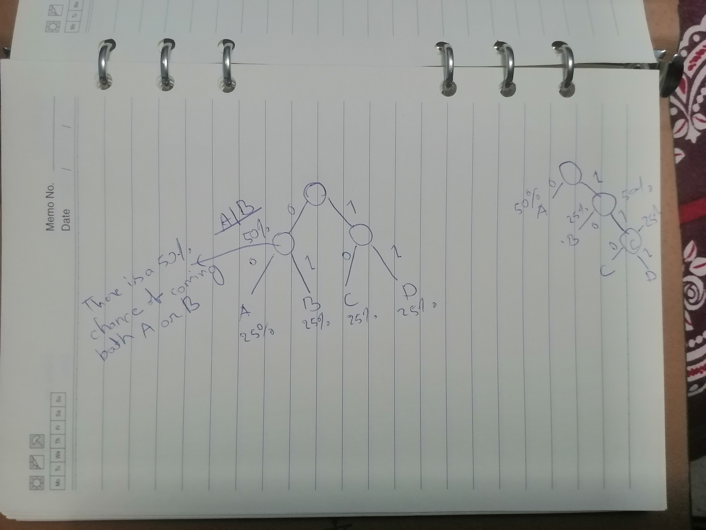
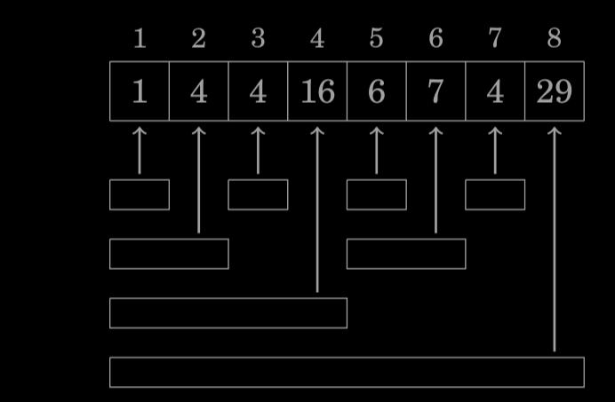
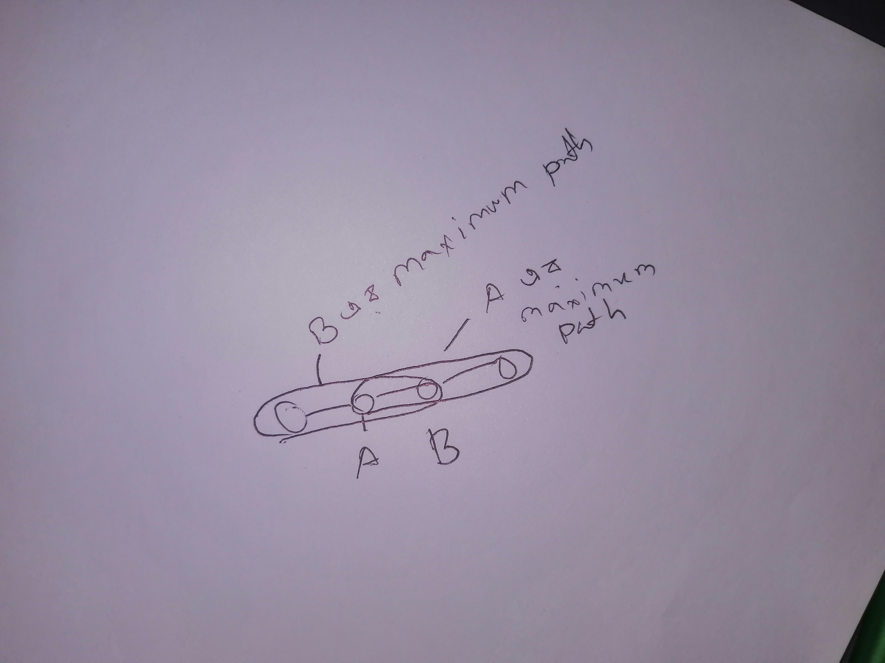
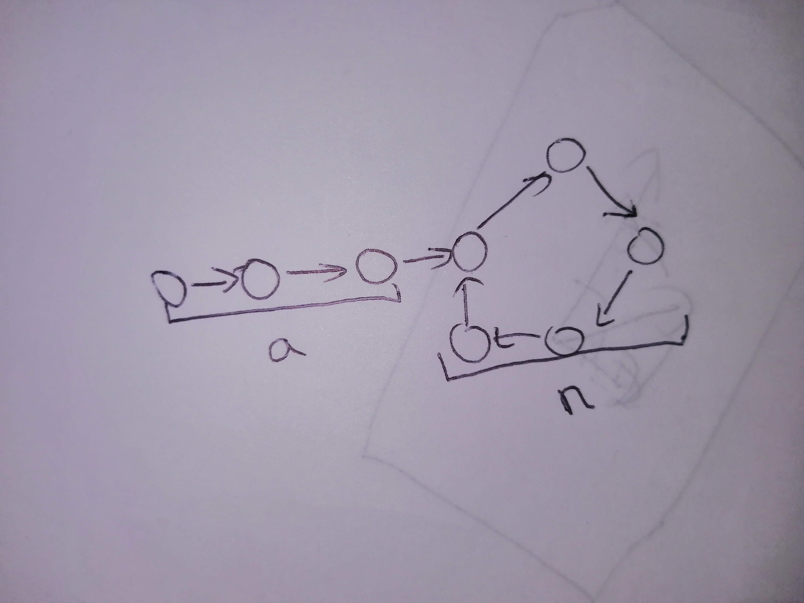

### TODO:
1. How much huffman compression reduce.A geometric visualization of the compression.
How much the memory reduce with different structure of the code.[Huffman compression](#huffman-coding)
2. Generate finwick tree.The code isn't complete.[Finwick tree](#indexed-tree-or-finwick-tree)
3. Solve the lift rise problem.[Lift](#lift-rise)
4. Why checking if a graph is tri-parrate is an NP hard problem?
5. Derive a mathematical prove for why spanning tree algorithm works?
6. There is a symmmetry in minimum edge in graph,tree.
## Maximum Subarray Sum
Problem: From a vector get the slice that  has the higest sum
This problem can be solved in O(n) time compliexity.

A=[-1 -2 1 2 5 -4 2 3 -1]

In here the maximum subarray is [1 2 5 -4 2 3]
1. A subarray must contain all positive slice. So given an array [1 2 3 4] [2 3] isn't maximum as
The they left [1,4] which is also the part of the positive slice.
2. If the slice contains negative number,the two side of the negative slice must have a sum.
In the array $A$ the maximum sum array is [1 2 5 -4 2 3] has [1 2 5],[-4],[2 3],so left and right side of the array is bigger than the middle.
the solution of the problem is 
```c++
int maxSubArray(vector<int> &num) {
  vector<int> ans;
  int sum = 0;
  bool is_positive = true;
  for (auto x : num) {
    if ((x >= 0) != is_positive) {
      is_positive = !is_positive;
      ans.push_back(sum);
      sum = x;
    } else {
      sum += x;
    }
  }
  ans.push_back(sum);
  vector<int> ans1;
  ans1.push_back(0);
  int negative = 0;
  for (auto x : ans) {
    // negative
    if (x < 0) {
      negative = -x;
    }

    // positive
    else if (x > negative && ans1.back() > negative) {
      ans1.back() += x - negative;
    }

    else {
      ans1.push_back(x);
    }
  }
  return *std::max_element(ans1.begin(), ans1.end());
}
```
Now this has a fault,I mistake an edge case of not having positive element. To fix it I could have a check for it.
#### What I learned:
1.Not to think about the perfect case.Even if that's the main priority,I have to not the other one too,which I forgot.

There is actually a dynamic approach to solve this problem.

Consider the subproblem of finding the maximum-sum subarray that ends at position k. There are two possibilities:
1. The subarray only contains the element at position k.
2.The subarray consists of a subarray that ends at position k−1, followed by the element at position k.
```c++
int max_sub_array(Vector& a){
    int best=-inf;
    int previous=best;
    for(auto x:a){
        current=max(x+previous,x);
        best=max(best,current);
    }
    return best;
}
```

## Binary search


```c++
int binary_search(Vec array&,int element){
    int left=0;
    int right=array.size();
    while(left<right){
        int middle=(left+right)/2;
        if (array[middle]<element){
            right=middle;
        }
        else{left=middle;}
    }
    return middle;
}
```

## Huffman coding 

Huffman coding is a memory optimization algorithm.The problem I have with it is:
1. It case of optimizing the object placement has to be of 50%,25%,12.5% and so on which is not efficient.
2. It optimize it with 0,10,110 and so on. It is not ideal.But it works in some cases.

It might be the most efficient way to deduce it.Here is a image.

Now a question is how much the huffman coding do reduce.
In the above image left side takes 2 bit on average where in the right side it take 1.75 bit on avg. So a 12.5% increase. So how does it work?The distribution. Is there any other distribution.
Things I learned: 
1. You have to think in the idealest form in a problem.Obiously a object coming up more than 50% of the time is unrealistic.But It does give you a set point.

**TODO**
## Longest increasing subsequence

#### Approch:

F(k)=max(F(x:(0..k) if arr[x]<=arr[k]))+1
where K=index of array,
After defining the function, ans=max(F(0..k));

#### What I learned:
1. When solving a problem,when attempting dynamic approach,I try to create a function that jumps to solution,
But I don't need to create such functions.I can create any function that can be related to that probelm.

## Subarray sum problem

The problem is to find a subarray that has a sum of x.Here all the numbers are positive. No negative number.

#### Approch:

1. Two pointer left and right,gives the range of slice.
2. On every step,the right pointer goes n steps to right as long as the slice sum is smaller or equal to x.
3. If the sum is not equal move the left pointer by 1.

## Sum2 and Sum3 probelm

Find 2 element that sums to x

## Indexed Tree or Finwick Tree

This is how to generate finwick tree.

The code would be something like
1. Create a getter function first. So after the finwick tree has beeen created how to get range of sum.
2. the function of the fenwick tree will be something like 
$$f(i)=sum(i-k+1,i)$$

where $k=max(2^n:2^n|i)$  here index start with 1.
## Market buy

Price of K products over n days.Buying each product exactly once per day,What is the minimum price of total
objects.

#### Approch
f(S,d)=min(total(S,d-1),min(total(S\x:S,d-1)+price[x][d]))
where S is the set of object,d is days.

#### Learned
1. Without going to solve the problem,It is always to explain it as a function aproach.It doesn't matter if the function take set as a input.
Now the problem is sometihing like this
memo[1<<K][d] where *K* is the number of products.Why K,because the number has now K zeros,because of indexing the index will go from 0 to K ones.

## Lift rise
A lift can lift maximum of w weights.Given k people with their weights.What is the minimum amount the lift need to be used for everybody rise?

#### Approach
1. One approach is to take all permutation and check one by one.Has a time complexity of O(N!),
This approach is not best because given one permuation of lift calcualtion say lift have a 10 max mass carry,
2 3 4 1 5 is the passenger weight. After calculating one permutation 2 3 4 ,we don't need to calculate 4 3 2,and other configration. In this case,they are behaving like set 2 3 4 is equivalent to 4 3 2.

2. Other observation is to use set,We know the maximum answer will be k,as there are k people.
So the question became,given K people distrubuted in K set.How to maximize the null set.Or what is the maximum number of null set.
    1. Another question:Given a set of n element,how many ways I can create:
        1. K ordered sets,so each element belongs to one set.
        2. A set of K set,so each element belongs to one set.
        3. K ordered sets,where no null set can exist.
        4. Given a function with range and domain,What are the different possible ways to map them?
**TODO**

## Counting Subsets
Given a set of $N$ number $A$,$P(A)$ is the set of all subsets of A.All the subsets are map to value $V(x:P(A))$
Find for all $X:P(A)$ $f(X)=\sum_{X_1\subset x} V(X_1)$

#### Approach
First thing is a good way to visualize.
It is good to visualize set as a number.
So having 4 item,it is 1111.
It has subset of 0 to 1111
>> Tips: If there is any need to remove a element from the set,
it is wise to remove it from last most element. So 1111-1<<3,
This way it became 111,the subset of the element is 0..111

Now $f(S)$ is the function,
    $f(1111)=f(111)+\sum_{x\subset P(111)}f(1000+x)$
    Which is not very recurisive example.
Other way to look at it is,other than saying like $f(1000+x)$,which means all possible sets 
thats includes the left most number,I can design the function as f(S,k) which means partial sum of 
all sets that don't remove 0..k elements.

Now the function would be f(S,0) is the value I want.
f(S,k)=V(S) is the base case.
Likewise f(S,K)=F(S,K+1) if K not in S,
else F(S-(K+1),k+1) +S(S,K+1)

#### Right approach:
The thing is when the S is decreasing in function,the K is increaseing,That makes a lot of edge case 
and probelm.
A wise way to solve it it keep the K decreasing when the S is decreasing as well.
A way to do it is,
So F(S,K) is 0..K subset that is active in S,only those values can be revoed ,other are static.
The edge case when dealing with subset like this is,
$F(S,k)=F(S,k-1) \tab  K \notin S$
So the function become 

$F(S,K)=\begin{cases}
F(S,k-1) & K\notin S \\
F(S,K-1) + F(S-K,K-1) & otherwise
\end{cases}$

#### Bi-parrate graph

A graph is considered bi-parrate if the graph can be colored using two color so no adjacant 
nodes have the same color.A graph is biparate if it doesn't have any odd cycle.
It can be solved first chossing 1 fixed color for a node ,than call recursively
If the graph need to be colored in k>2 colorsmit becomes a NP hard problem.
## TODO:
1.Why it is a NP hard problem?

# Tree
### Diameter
Diameter is the maximum length path of tree.

#### Approach
1. One apporach is given a point,get the max distance node,
from that point maybe using depth first search
Teh from the max distance point,find the max distance from that point.

2. Choosing a node to be the root node.
    recursively calculate the height of the node.For each node save two data.The height of it's maximum 2 child node.The maximum lenght path is sum of those two.


Of all the node,the root of the maximum length path has 2 maximum child path 6,4
In a simple word,
1. After rooting the tree arbitrarilly,the highest path also has a highest root.We just need to find the root.

### All longest Path
For a tree,for each node find the longest path lenght that start from that node.

#### Mistake:
1. To start the problem I just was like if the f(x:Node)->int is the function than,
```python
def f(x:Node):
    ans=0
    for i in x.child:
        ans=max(ans,f(i))
    return ans+1
```
But that is a mistake. In the picture you can see,

$f(A)=max(f(B),F(Other))+1$ which is clearly mistake.
### What I learned:
1.Even though there is no circular loop in tree,You can self reference yourself in dynamic programming,
When choosing the root arbitrary in tree.Like When I tried to find the maximum path using 
$f(A)=max(f(B),F(Other))$ where $f(B)=max(f(A),f(Other))$

#### Apporach
1.The first idea will work,If there is no self reference.We could do it,while calculating for each node
we will check it for two the maximum node.The function will output the array{(max_len1,node1),(max_len2,node2)}
So,
```python
def f(x:Node)->((max_len1,node1),(max_len2,node2)):
    pq=priority_queue();
    for i in x.child:
        ans=f(i)
        if(ans[0][1]!=x)pq.append(ans[0])
        else pq.append(ans[1])
    ans1=pq.pop(default=(0,11111111111))
    ans2=pq.pop(default=(0,11111111111))
    return (ans1,ans2)

```

## Spanning tree
#### Approach
1. 
    - Sort all the edge.
    - Add small edge to big edge in a graph,only if the edges connect two disconnected graph.
2.
    - Select a node from the graph.Add all the edge of the node in a priority queue.
    - Add the edge in the graph from minimum if the edge add new node in the spanning tree.
    - For the new node,add all it's edge to the priority queue.
#### Why it works
I have a problem understanding it.
Like had some confusion.Like if I start adding edge in increasing order,How it is garunteed.
Like why something this won't happen,
Chossing the lowest edge in the circuit will force me
to have the biggest edge.
To Understand it clearly,Let's observe it from different way:
1. Spanning tree is a tree,So from every node there is only one node to other node.
2. A minimum connected graph will be a spanning tree.
3. Because it is a tree,only one edge is needed to add one node.

## Topological Sort
In a directed graph,A topological sort is ordered list of nodes,so that if a path exist from Node A to B
then the B node should be right side of node A.

#### Observation
1. A topological sort can't be possible,If there is a loop in a path.
So our algorithm should check if there is a loop or not in the graph,
It would be invalid if there is one.
2. If it a recursion,It should be only depends on the adjecent outgoing node.
3. So the way it is like going through all of the path of outgiong node,and check if 
it is going to the parent node,forming a loop.
2. The topological sort problem can be seperated as a subproblem.
    - For a node $A$ let's denote the set of all Node that have a path from $A$,as $S(A)$.
    It also contain $A$.
    - $F(A)=\union_{x\in Ad(A)} F(x)$ where $Ad(A)$ is all the adjeccent Node of $A$,only the outgoing edge.
    - Now all the outgoing node the first one that is calculated wiil be last in the list.(Because thereis other possibility that other outgoing nodes will have reference to previous processed node. )
    - As I said before "Now all the outgoing node the first one that is 
    calculated wiil be last in the list",and the program is recursive,We could just add the node after
    it has been completed first,then flip the entire list.
    - If a node is pointing to a node is still processing,There will be no topological sort.
    - 

#### Approach
1. A directed graph is  not a tree,Because it can have circular edges,but because of directed edges,in a topological sort it can have one path..
2. First I need to find a node with no ingoing edge.It can be treated as a head.

## Successor graph
A successor graph can be treated as a function,because each node has 1 outgoing edge.
Let's say that function is $f(A:Node)$.
Define other function as g(A:Node,N),
$$g(A:Node,N)=\begin{cases}
    A & if~N=0,\\
    f(g(A,N-1)) & else
\end{cases}$$

We can see that 
$$g(A,N+M)=g(g(A,N),M)$$
so $g(A,2N)=g(g(A,N),N)$

So this function obeys the communitative and associative property.
When there is a function that obeys associative and communitative property,and 
need need balanced time and memory complexity it's better to use binary distribution.

**TODO: Prove that the function g obeys associative and communitative property.**

## What I learned:
1. I need to use exponent notation extensibly,to describe any types of repitition happening.Like
$f(f(x))=f^2(x)$
## Floyd' Algorithm
Floyd's algorithm tries to find loop from a successor graph,
(A graph where every node has one outgoing node.)
The time complexity of the algorithm is O(N) and a space complexity of O(1),

Have 2 pointer $A$ & $B$,be at the start of the path,
each turn $A$ goes 1 step,$B$ goes 2 step.
After $a$ turn both of them are in the loop.
$A=0 \mod {n} \\
B=a \mod{n} $
1. Because $A$ and $B$ has 1 relative velocity and distance $\frac{-a}{\mod n}$,
after $n-a$ step,both of them will meet in $\frac{-a}{\mod n}$,
2. After that match set the $A$ pointer to the beginning of the path.
3. Both have a distance of $a$ to the 0 position of the loop.

## Strong Connectivity of Graph
A directed graph can't be topologically sort if there are loop in them.
A loop is a strongly connected graph.
So if I treat strongly connected compenent of the graph as one node,
I can topologically sort them.
Like in the djkstra algorithm to do topological sort,
**TODO:**
1. How the algorithm of the book works?
2. SAT2 problem
3. Why SAT3 is np hard problem?


