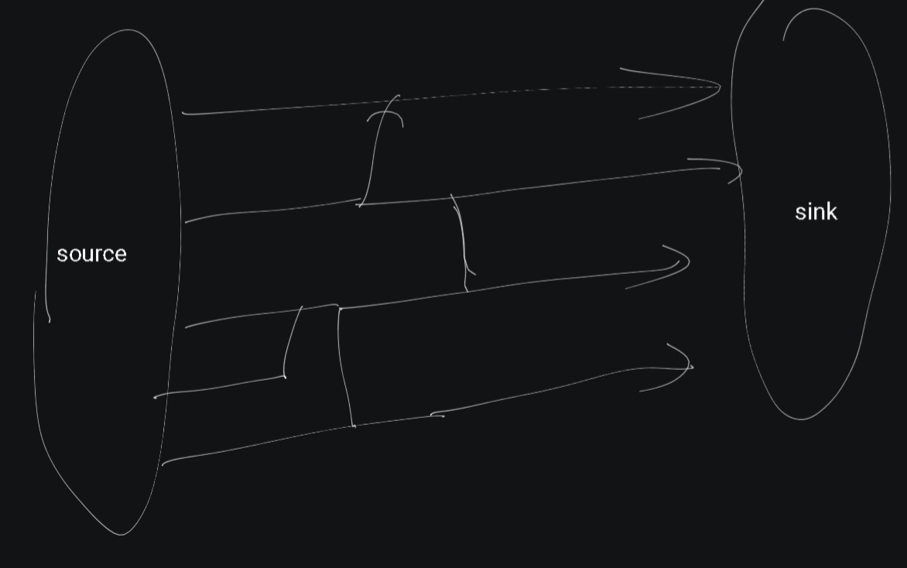
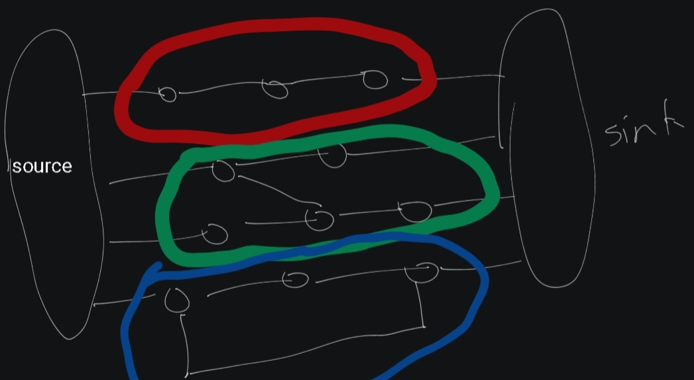

# This note is to understand maximum flow and minimum cut, so they feel obious.

## Maximum flow:
In a directed weighted graph,the weight is the maximum capacity the edge can carry.Maximum weight is the the amount that can I deliver from source to sink.

Now in a mathematical approch,it can be written as,___________________

To study the maximum flow and minimum cut,the best visualization of the graph is something like this.

We only included all the edges that contributed to make path from source to sink.All the other edges are removed because they neither add anything to maximum flow or minimum cut.Between the main path,drawn as direct line from source to sink.There are edges are connect one path to other path,also path that connect to itself.

Here we can also simplify the graph much further. In the red edge segment,we can simplify the edges with min(edges weights),Because the maximum flow in the edge segment is the min ofthe edge weight.Same goes for minimum cut.
In the blue edge list the maximum flow and minimum cut is equivalent to min(edge_segment1)+min(edge_segment2),it just means edge1+edge2 after simplifying the edge 

Now the green one,that's connects two path with an edge that is a hard one to reason with,
